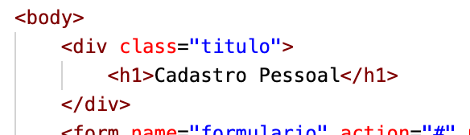
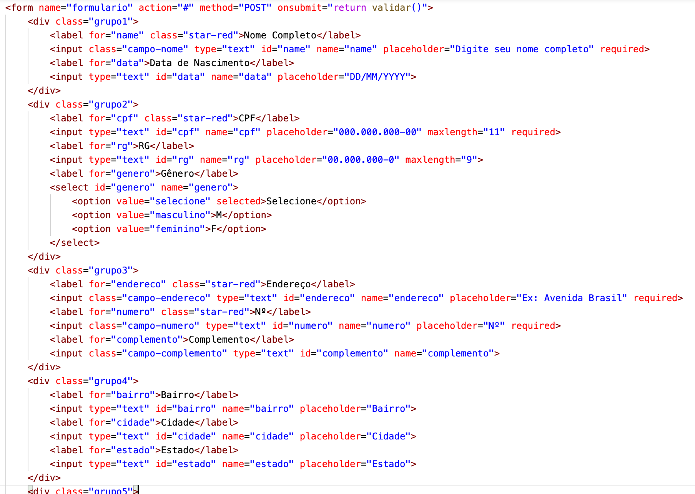
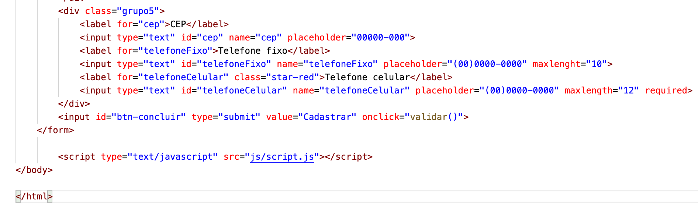

# Documentação

O formulário de Cadastro Pessoal para registrar dados pessoais. Contém campos: Nome, CPF, RG, gênero, Endereço, Número, Bairro, Cidade, Estado, CEP, Telefone Fixo, Telefone Celular. Inclui mais duas campos são Data de Nascimento e Complemento.

Foi feito em <b>HTML</b>, <b>CSS</b> e <b>Javascript</b>.

Começando pelo formato <b>HTML</b>:

<b>Título</b>

Nesta página <b>cadastro.html</b>, há treze pra preencher campos e tem um tipo select com as opções M=Masculino ou F=Feminino.

<b>Form</b> contém 1 divisão pai e 5 divisões filhos.
 

